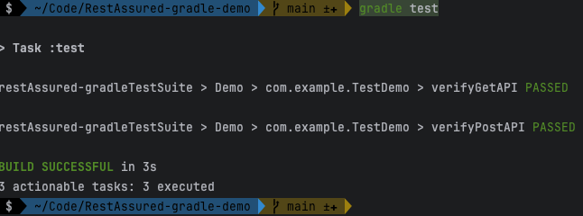
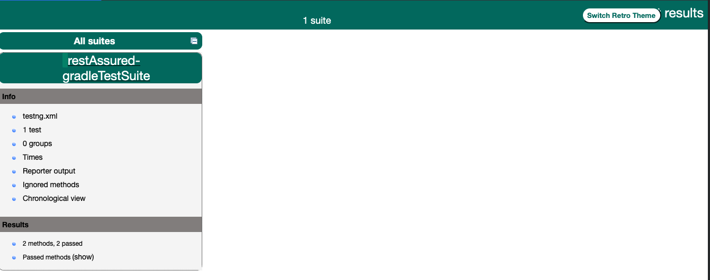
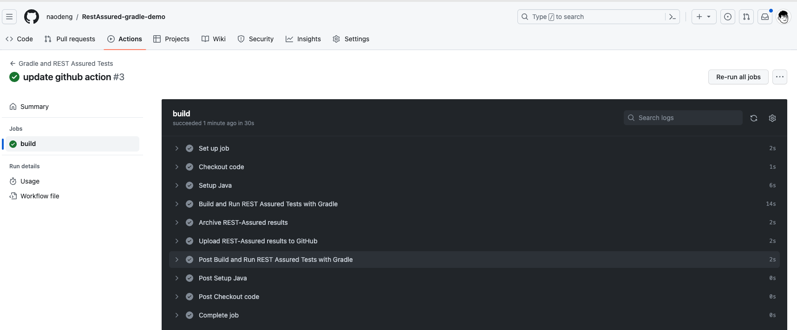

# RestAssured 接口自动化测试开始启动项目

关于使用 RestAssured 进行 API 测试的快速启动项目介绍文档。

**中文** | [English](/README_EN.md)

- [RestAssured 接口自动化测试开始启动项目](#restassured-接口自动化测试开始启动项目)
  - [RestAssured 介绍](#restassured-介绍)
  - [项目结构](#项目结构)
    - [Gradle 构建的版本](#gradle-构建的版本)
    - [Maven 构建的版本](#maven-构建的版本)
  - [项目依赖](#项目依赖)
  - [从 0 到 1 搭建 REST Assured 接口测试项目](#从-0-到-1-搭建-rest-assured-接口测试项目)
    - [Gradle 版本](#gradle-版本)
      - [创建一个空的 Gradle 工程](#创建一个空的-gradle-工程)
      - [配置项目 build.gradle](#配置项目-buildgradle)
      - [testng.xml 配置](#testngxml-配置)
      - [gradle build 项目并初始化](#gradle-build-项目并初始化)
      - [初始化目录](#初始化目录)
      - [demo 测试接口](#demo-测试接口)
        - [Get 接口](#get-接口)
        - [Post 接口](#post-接口)
      - [编写脚本](#编写脚本)
      - [调试脚本](#调试脚本)
      - [查看测试报告](#查看测试报告)
        - [命令行报告](#命令行报告)
        - [testng html 报告](#testng-html-报告)
    - [Maven 版本](#maven-版本)
      - [创建一个空的 Maven 工程](#创建一个空的-maven-工程)
      - [配置项目 pom.xml](#配置项目-pomxml)
      - [初始化目录](#初始化目录-1)
      - [编写脚本](#编写脚本-1)
      - [调试脚本](#调试脚本-1)
  - [进阶用法](#进阶用法)
    - [持续集成](#持续集成)
      - [接入 github action](#接入-github-action)
        - [Gradle 版本](#gradle-版本-1)
  - [参考资料](#参考资料)

## RestAssured 介绍

REST Assured 是一种用于测试 RESTful API 的 Java 测试框架，它使开发人员/测试人员能够轻松地编写和执行 API 测试。它的设计旨在使 API 测试变得简单和直观，同时提供了丰富的功能和灵活性。以下是 REST Assured 的一些重要特点和用法：

1. 发起 HTTP 请求：REST Assured 允许你轻松地构建和发起 HTTP GET、POST、PUT、DELETE 等类型的请求。你可以指定请求的 URL、头部、参数、体等信息。

2. 链式语法：REST Assured 使用链式语法，使测试代码更加可读和易于编写。你可以按照一种自然的方式描述你的测试用例，而不需要编写大量的代码。

3. 断言和校验：REST Assured 提供了丰富的校验方法，可以用于验证 API 响应的状态码、响应体、响应头等。你可以根据你的测试需求添加多个断言。

4. 支持多种数据格式：REST Assured 支持多种数据格式，包括 JSON、XML、HTML、Text 等。你可以使用适当的方法来处理不同格式的响应数据。

5. 集成 BDD（行为驱动开发）：REST Assured 可以与 BDD 框架（如 Cucumber）结合使用，使你可以更好地描述和管理测试用例。

6. 模拟 HTTP 服务器：REST Assured 还包括一个模拟 HTTP 服务器的功能，允许你模拟 API 的行为以进行端到端测试。

7. 可扩展性：REST Assured 可以通过插件和扩展进行定制，以满足特定的测试需求。

总的来说，REST Assured 是一个功能强大且易于使用的 API 测试框架，它可以帮助你轻松地进行 RESTful API 测试，并提供了许多工具来验证 API 的正确性和性能。无论是初学者还是有经验的开发人员/测试人员，REST Assured 都是一个非常有价值的工具，可用于快速的上手 API 自动化 测试。

## 项目结构

### Gradle 构建的版本

```text
- src
  - main
    - java
      - (应用的主要源代码)
  - test
    - java
      - api
        - (REST Assured 测试代码)
          - UsersAPITest.java
          - ProductsAPITest.java
        - util
          - TestConfig.java
    - resources
      - (配置文件、测试数据等)
  - (其他项目文件和资源)
- build.gradle (Gradle 项目配置文件)
```

在这个示例目录结构中：

- src/test/java/api 目录用于存放 REST Assured 的测试类，每个测试类通常涉及到一个或多个相关的 API 端点的测试。例如，UsersAPITest.java 和 ProductsAPITest.java 可以包含用户管理和产品管理的测试。
- src/test/java/util 目录可用于存放测试中共享的工具类，例如用于配置 REST Assured 的 TestConfig.java。
- src/test/resources 目录可以包含测试数据文件、配置文件等资源，这些资源可以在测试中使用。
- build.gradle 是 gradle 项目的配置文件，它用于定义项目的依赖项、构建配置以及其他项目设置。

### Maven 构建的版本

```text
- src
  - main
    - java
      - (应用的主要源代码)
  - test
    - java
      - api
        - (REST Assured 测试代码)
          - UsersAPITest.java
          - ProductsAPITest.java
        - util
          - TestConfig.java
    - resources
      - (配置文件、测试数据等)
  - (其他项目文件和资源)
- pom.xml (Maven 项目配置文件)
```

在这个示例目录结构中：

- src/test/java/api 目录用于存放 REST Assured 的测试类，每个测试类通常涉及到一个或多个相关的 API 端点的测试。例如，UsersAPITest.java 和 ProductsAPITest.java 可以包含用户管理和产品管理的测试。
- src/test/java/util 目录可用于存放测试中共享的工具类，例如用于配置 REST Assured 的 TestConfig.java。
- src/test/resources 目录可以包含测试数据文件、配置文件等资源，这些资源可以在测试中使用。
- pom.xml 是 Maven 项目的配置文件，它用于定义项目的依赖项、构建配置以及其他项目设置。

## 项目依赖

- JDK 1.8+ ，我使用的 JDK 19
- Gradle 6.0+ 或 Maven 3.0+，我使用的 Gradle 8.44 和 Maven 3.9.5
- RestAssured 4.3.3+，我使用的是最新的 5.3.1 版本

## 从 0 到 1 搭建 REST Assured 接口测试项目

REST Assured 支持 Gradle 和 Maven 两种构建工具，你可以根据自己的喜好选择其中一种。下面分别介绍 Gradle 和 Maven 两种构建工具的项目初始化过程。

本项目使用 Gradle 8.44 和 Maven 3.9.5 进行构建，如果你使用的是其他版本，可能会有不同。

### Gradle 版本

可参考 demo 项目：<https://github.com/Automation-Test-Starter/RestAssured-gradle-demo>

#### 创建一个空的 Gradle 工程

```bash
mkdir RestAssured-gradle-demo
cd RestAssured-gradle-demo
gradle init
```

#### 配置项目 build.gradle

demo 项目引入了 testNG 测试框架，仅供参考

- 在项目根目录下创建一个 build.gradle 文件，用于配置项目
- 示例配置如下，可供参考

```groovy
// 插件配置
plugins {
    id 'java' // 使用 java 插件
}

// 仓库资源配置
repositories {
  mavenCentral() // 使用 maven中央版本库源
}

// 项目依赖配置
dependencies {
    testImplementation 'io.rest-assured:rest-assured:5.3.1' // 添加rest-assured依赖
    testImplementation 'org.testng:testng:7.8.0' // 添加TestNG测试框架依赖
    implementation 'org.uncommons:reportng:1.1.4' // 添加testng 测试报告依赖
    implementation 'org.slf4j:slf4j-api:2.0.9' // 添加测试日志依赖
    implementation 'org.slf4j:slf4j-simple:2.0.9' // 添加测试日志依赖
    implementation group: 'com.google.inject', name: 'guice', version: '7.0.0'
}

// 项目测试配置
test {
    reports.html.required = false // 禁用 gradle 原生HTML 报告生成
    reports.junitXml.required = false // 禁用 gradle 原生 JUnit XML 报告生成
    // 告诉 Gradle 使用 TestNG 作为测试框架
    useTestNG() {
        useDefaultListeners = true
        suites 'src/test/resources/testng.xml' // 声明 testng 的 xml 配置文件路径
    }
    testLogging.showStandardStreams = true // 将测试日志输出到控制台
    testLogging.events "passed", "skipped", "failed" // 定义测试日志事件类型
}
```

> 可 copy 本项目中的 build.gradle 文件内容，更多配置可参考[官方文档](https://github.com/rest-assured/rest-assured/wiki/GettingStarted#rest-assured)

#### testng.xml 配置

- 在 src/test目录下创建一个 resources 目录，用于存放测试配置文件

- 在 resources 目录下创建一个 testng.xml 文件，用于配置 TestNG 测试框架

- 示例配置如下，可供参考

```xml
<?xml version="1.0" encoding="UTF-8"?>
<!DOCTYPE suite SYSTEM "http://testng.org/testng-1.0.dtd">
<suite name="restAssured-gradleTestSuite">
<test thread-count="1" name="Demo">
    <classes>
        <class name="com.example.TestDemo"/> <!-- 测试脚本 class-->
    </classes>
</test> <!-- Test -->
</suite> <!-- Suite -->
```

#### gradle build 项目并初始化

- 用编辑器打开本项目 Terminal 窗口，执行以下命令确认项目 build 成功

```bash
gradle build
```

- 初始化完成：完成向导后，Gradle 将在项目目录中生成一个基本的 Gradle 项目结构
  
#### 初始化目录

目录结构可参考 >> [项目结构](#项目结构)

在项目的测试源目录下创建一个新的测试类。默认情况下，Gradle 通常将测试源代码放在 src/test/java 目录中。你可以在该目录下创建测试类的包，并在包中创建新的测试类

创建一个 TestDemo 的测试类，可以按以下结构创建文件
  
```text
src
└── test
    └── java
        └── com
            └── example
                └── TestDemo.java
```

#### demo 测试接口

##### Get 接口

- HOST: https://jsonplaceholder.typicode.com
- 接口地址：/posts/1
- 请求方式：GET
- 请求参数：无
- 请求头："Content-Type": "application/json; charset=utf-8"
- 请求体：无
- 返回状态码：200
- 返回头："Content-Type": "application/json; charset=utf-8"
- 返回 body：

```json
{
    "userId": 1,
    "id": 1,
    "title": "sunt aut facere repellat provident occaecati excepturi optio reprehenderit",
    "body": "quia et suscipit\nsuscipit recusandae consequuntur expedita et cum\nreprehenderit molestiae ut ut quas totam\nnostrum rerum est autem sunt rem eveniet architecto"
}
```

##### Post 接口

- HOST: https://jsonplaceholder.typicode.com
- 接口地址：/posts
- 请求方式：POST
- 请求参数：无
- 请求头："Content-Type": "application/json; charset=utf-8"
- 请求体：raw json 格式 body 内容如下：

```json
{
    "title": "foo",
    "body": "bar",
    "userId": 1
}
```

- 返回状态码：201
- 返回头："Content-Type": "application/json; charset=utf-8"
- 返回 body：

```json
{
    "title": "foo",
    "body": "bar",
    "userId": 1,
    "id": 101
}
```

#### 编写脚本

- 打开 TestDemo.java 文件，开始编写测试脚本

- 示例脚本如下，可供参考

```java
package com.example;

import org.testng.annotations.Test;

import static io.restassured.RestAssured.given;
import static org.hamcrest.Matchers.equalTo;

public class TestDemo {

 @Test(description = "Verify that the Get Post API returns correctly")
 public void verifyGetAPI() {

  // Given
  given()
    .baseUri("https://jsonplaceholder.typicode.com")
             .header("Content-Type", "application/json")

  // When
  .when()
    .get("/posts/1")

  // Then
  .then()
    .statusCode(200)
    // To verify correct value
    .body("userId", equalTo(1))
    .body("id", equalTo(1))
    .body("title", equalTo("sunt aut facere repellat provident occaecati excepturi optio reprehenderit"))
    .body("body", equalTo("quia et suscipit\nsuscipit recusandae consequuntur expedita et cum\nreprehenderit molestiae ut ut quas totam\nnostrum rerum est autem sunt rem eveniet architecto"));
 }
 @Test(description = "Verify that the publish post API returns correctly")
 public void verifyPostAPI() {

  // Given
  given()
    .baseUri("https://jsonplaceholder.typicode.com")
    .header("Content-Type", "application/json")

    // When
    .when()
    .body("{\"title\": \"foo\", \"body\": \"bar\", \"userId\": 1\n}")
    .post("/posts")

    // Then
    .then()
    .statusCode(201)
    // To verify correct value
    .body("userId", equalTo(1))
    .body("id", equalTo(101))
    .body("title", equalTo("foo"))
    .body("body", equalTo("bar"));
 }
}
```

#### 调试脚本

- 打开本项目的 Terminal 窗口，执行以下命令运行测试脚本

```bash
gradle test
```

#### 查看测试报告

##### 命令行报告



##### testng html 报告

- 打开项目 build/reports/tests/test 目录
- 点击 index.html 文件，查看测试报告



### Maven 版本

#### 创建一个空的 Maven 工程

#### 配置项目 pom.xml

#### 初始化目录

#### 编写脚本

#### 调试脚本

## 进阶用法

### 持续集成

#### 接入 github action

以 github action 为例，其他 CI 工具类似

##### Gradle 版本

可参考 demo：<https://github.com/Automation-Test-Starter/RestAssured-gradle-demo>

创建.github/workflows 目录：在你的 GitHub 仓库中，创建一个名为 .github/workflows 的目录。这将是存放 GitHub Actions 工作流程文件的地方。

创建工作流程文件：在.github/workflows 目录中创建一个 YAML 格式的工作流程文件，例如 gradle.yml。

编辑 gradle.yml 文件：将以下内容复制到文件中
  
```yaml
name: Gradle and REST Assured Tests

on:
  push:
    branches: [ "main" ]
  pull_request:
    branches: [ "main" ]

jobs:
  build:
    runs-on: ubuntu-latest

    steps:
      - name: Checkout code
        uses: actions/checkout@v3

      - name: Setup Java
        uses: actions/setup-java@v3
        with:
          java-version: '11'
          distribution: 'adopt'

      - name: Build and Run REST Assured Tests with Gradle
        uses: gradle/gradle-build-action@bd5760595778326ba7f1441bcf7e88b49de61a25 # v2.6.0
        with:
          arguments: build

      - name: Archive REST-Assured results
        uses: actions/upload-artifact@v2
        with:
          name: REST-Assured-results
          path: build/reports/tests/test

      - name: Upload REST-Assured results to GitHub
        uses: actions/upload-artifact@v2
        with:
          name: REST-Assured-results
          path: build/reports/tests/test
```

- 提交代码：将 gradle.yml 文件添加到仓库中并提交。
- 查看测试报告：在 GitHub 中，导航到你的仓库。单击上方的 Actions 选项卡，然后单击左侧的 Gradle and REST Assured Tests 工作流。你应该会看到工作流正在运行，等待执行完成，就可以查看结果。



## 参考资料

- Rest assured 官方文档：<https://rest-assured.io/>

- Rest assured 官方 github：<https://github.com/rest-assured/rest-assured>

- Rest assured 官方文档中文翻译：<https://github.com/RookieTester/rest-assured-doc>
